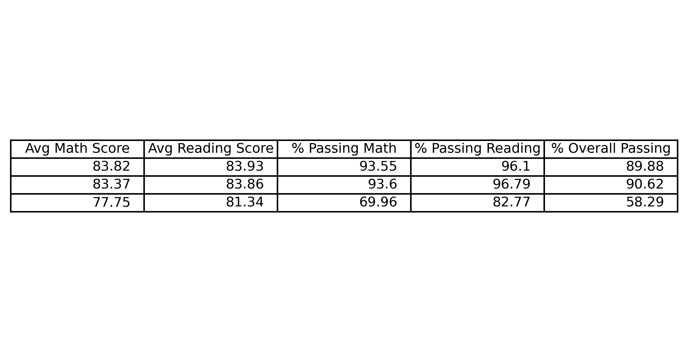
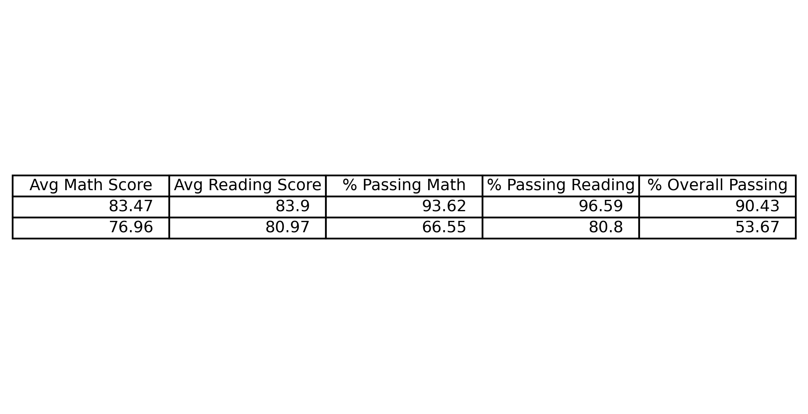

# Module 4 Challenge: Data Analysis with Python

<ins>Project Overview</ins>

This project analyzed the school and district-wide standardized test results to help the school board and mayor make strategic decisions regarding future school budgets and priorities. I was given access to every student's math and reading scores, as well as various information on the schools they attend.

<ins>Processes and Technologies</ins>

In order to complete the deliverables, I aggregated the data to showcase obvious trends in school performance py creating and manipulating Pandas DataFrames.

*District, School and Test Score Analysis*
First, I used `nunique` to count the total number of schools in the in the `school_name` column and the `len` function to determine the total number of students. Next, I used `.mean` to calculate the mean of the reading and math scores and passed this data into a new DataFrame. The next part of the deliverable asked me to calculate the counts for school summary, after calculating the student count, budget, average math & reading scores per school, I looked at all the schools with math scores and reading scores of 70 or higher(in separate outputs) in order to see the individual schools close to an acceptable success rate. I concluded my analysis by creating summary tables for math or reading scores by grade, school size and school type.
#### Score  by School Size ####

#### Score  by School Type ####

*Spending Analysis*
For this section of the deliverable, I utilized the "Per Student Budget" column in order categorize the spending based on the bins which gave the spending ranges per student. I calculated the math, reading, overall and % passing averages for the 'Spending Ranges Per Student' column and assembled the data into a data frame. I used 'pd.cut' to accomplish these tasks, and once the per_school_summary was created, I could calculate the average for the School Size and School Type and create new DataFrames.

<ins>Conclusions</ins>

From the sections on the lowest performing schools and highest performing schools, I was able to make several interesting conclusions and comparisions. First, these showed that 80% of the top ten performing schools were all charters and 70% of the lowest performing schools were all districts. This might have been the data that was expected by school type, but upon further analysis, the school type is not necessarily what determined the passing rates. 
While the per student spending is very similar for the charters and the districts, 87% of charters were categorized as small or medium schools while 100% of the districts were categorized as large schools. Additionally, even though both school types spent similar amounts per student, the small and medium sized schools (both charter and district) consistently showed a higher achievement and overall passing rate.

Secondly, it is interesting to note that even though the top eight highest performing schools were charters, they only out performed the district on their average math score by about 7% and reading by about 3%. The overall pass rate, however, shows the districts at 53% and the charters at 90%. This disparity in average achievement further shows the difference between the school sizes and the affect on student achievement.

Since the small and medium sized school consistently out performed the larger schools in every metric for both math and reading, one might conclude that smaller school population sizes contribute greatly to the success of their students.

<ins>Challenges</ins>
When completeing the PyCity Schools deliverable for school analysis, at first I did not divide by `float(student_count)` and I was unable to calculate the percentage of students who passed the math or reading tests. After reviewing the documentation, I was able to see my mistake and remedied it. In this challenge, I collaborated with fellow bootcamp members, Kimberly Reitama and Saroja Shrestha.
